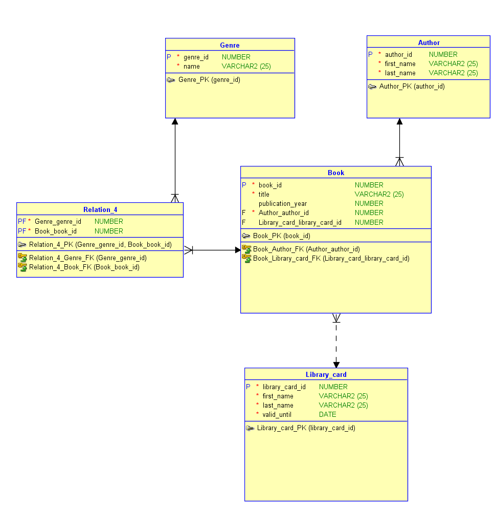

# Library App

Java command line application enabling users to search, borrow, return and donate book(s) to a library.

# Code Properties

- Database design and implementation
- Data read from a spreadsheet into database
- Backend implementation of CRUD operations on a database
- Models, Controllers and Repositories
- Connection pool
- No service layer
- No framework

# Tools and technologies

- JavaSE, including JDBC API
- SQLite db
- Apache DBCP package
- Apache POI XSSF
- Maven

# Code Architecture

- Repository design pattern
- Template design pattern

# Library Database Model

# Links

[SQLite](https://webpack.js.org/)

[Apache DBCP](http://commons.apache.org/proper/commons-dbcp/)

[Apache POI](https://poi.apache.org/apidocs/dev/org/apache/poi/xssf/usermodel/)

[Maven Repository](https://mvnrepository.com/)